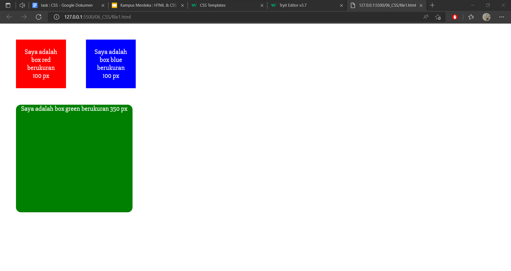
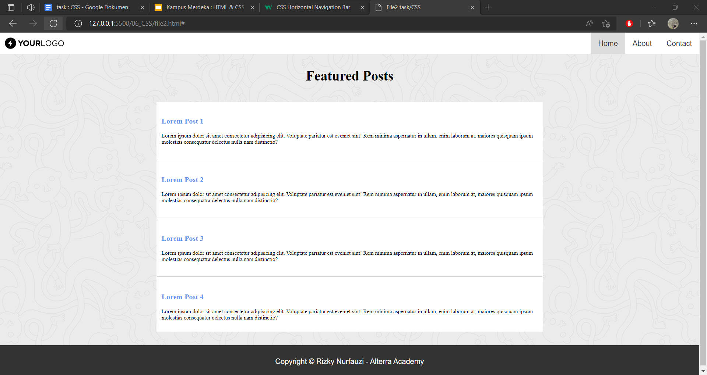

## Resume Materi CSS

Nama : Rizky Nurfauzi   
Kelas : React A

CSS (*Cascade Style Sheet*) adalah sebuah bahasa untuk mengatur tampilan web sehingga terlihat lebih menarik dan indah  
Dengan CSS, kita dapat mengatur layout (tata letak), warna, font, garis, background, animasi, dan lain-lain.

Cara menambahkan file CSS kepada HTML mempunyai 3 cara, yaitu :  
1. External CSS, ditulis di file CSS terpisah dengan HTML  
2. Internal CSS, ditulis di dalam tag `<style>`   
3. Inline CSS, ditulis di atribut elemen HTML  

Struktur pada CSS pun terdiri dari 3 bagian, yaitu : 
1. Selektor, adalah kata kunci untuk memilih elemen HTML yang akan kita beri style.  
2. Blok Deklarasi, adalah tempat kita menuliskan atribut atau properti CSS yang akan diberikan.
3. Properti dan nilai nya, dalah sekumpulan aturan yang akan diberikan kepada elemen yang dipilih. penulisannya adalah seperti `properti: "nilai";`.

## Task CSS

1. Ubahlah tampilan dari file1.html sehingga menjadi seperti ini Ketentuan : gunakan `font-family: 'Slabo 27px', serif;` dan `font-size: 20px;`  
  

2. Buatlah sebuah file dengan nama file2.html dengan desain seperti berikut. Di bagian header kalian diberi kebebasan untuk memperbaiki bentuk dan responsive. Yang terpenting konten dan letak dari header masih sama.  
  
