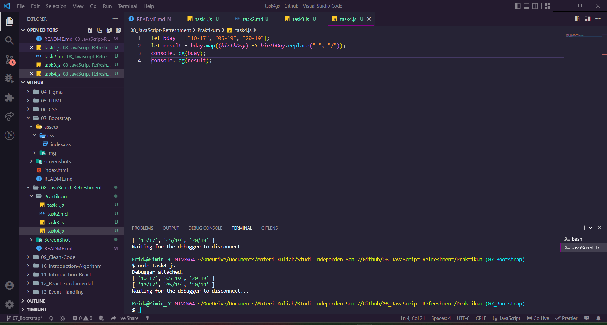

## **Resume Materi Javascript-Refreshment**

Nama : Rizky Nurfauzi   
Kelas : React A

> `JavaScript` merupakan bahasa pemrograman yang high-level, scripting, untyped, dan juga interpreted.  
  
### 1. **Values**

Dalam materi ini terdapat 3 poin utama yaitu `Declaration`, `Scooping` dan `Hoisting`

- `Declaration` merupakan sebuah proses pembuatan variabel untuk menyimpan sebuah data. Pada declaration terdapat 3 cara deklarasi yaitu ada `var`, `let`, dan `const`.  
- `Scooping` merupakan cara bagaimana menentukan sebuah variabel, fungsi, dan objek dapat diatur dan diakses dalam `code`. Pada Scooping terpadat 3 kategori yang pertama   ada `global`, `function`, serta `block`
- `Hoisting` merupakan cara membuat beberapa jenis data atau fungsi yang dapat digunakan sebelum di deklarasikan. Pada kasusnya biasanya untuk hoisting menggunakan `var`.  

### 2. **Understanding Variable**

Dalam kategori ini terdapat 2 kategori tipe data yaitu **primitive** dan **object** .  

- `Primitif` merupakan unit pemrosesan terkecil dan elemen paling sederhana dalam sebuah bahasa pemrograman. Contoh dari tipe data primitif adalah sebagai berikut :
  - `string`
  - `boolean`
  - `number`
  - `undefined`
  - `null`
  - `symbol`
  - `BigInt` pada ES11.

### 3. **Destructuring**

`Destructuring` merupakan sebuah metode untuk memecah komponen yang kompleks menjadi komponen yang lebih kecil.  

`Spread` digunakan ketika semua element atau array perlu dimasukan kedalam sebuah daftar.  

### 4. **Method**

Pada method terdapat 6 jenis yaitu :

- `Concat`
- `Map`
- `Foreach`
- `Slice`
- `Filter`
- `Reduce`

### 5. **Control Flow**

`Control Flow` merupakan metode cara mengatur alur eksekusi pada statement.

1. Pengulangan

- `for`
- `while`
- `do while`

2. Pengkondisian

- `if`
- `if else`
- `switch`
- `block`
- `try ..catch`
- `break`
- `continue`
- `throw`

### 6. **Function**

`function` dalam javascript merupakan sebuah object yang berguna untuk melakukan komputasi yang dapat digunakan berulang kali.

- `Function`
- `Function Expression`
- `Arrow Fuction`

```js
const name = (firstName, lastName) => {
  console.log(`${firstName} ${lastName}`);
};
name("rizky", "nurfauzi");
```

### 7. **Class**

`class` merupakan sebuah template atau blueprint untuk membuat object.

Materi pada Class terdapat :  
- *Class*
- *Constructor*
- *Method*
- *Attributes*
- *Extend*

```js
class People {
  constructor(name, age) {
    //this is attribute
    this.name = name;
    this.age = age;
  }
  greetings() {
    //this is method
    return `Saya ${this.name}, berumur ${this.age} tahun`;
  }
}
const kim = new People("rizky", 20);
console.log(kim.greetings());
```

### 8. **Async Wait**

1. `Syncronous` merupakan cara mengeksekusi setiap perintah sesuai urutannya yang kita tuliskan.

```js
console.log("Mulai");
console.log("Proses");
console.log("Berakhir");
```

2. `Asyncronous` merupakan cara eksekusi berdasarkan waktu dan proses.

```js
console.log("Mulai");
setTimeout(() => {
  console.log("Proses....", 1000);
});
console.log("Berakhir");
```

### 9. **DOM**

`DOM` (*Document Object Model*) merupakan sebuah API untuk HTML yang merepresentasikan halaman web pada suatu document menjadi sebuah object. Pada DOM terbagi 3 kategori yang pertama **DOM Selection Method**, **DOM Manipulation**,dan **DOM Event**.

- `DOM Selection Method`

| Event                   | Kegunaan        |
| ----------------------- | --------------- |
| getElementById()        | Element         |
| getElementByTagName()   | HTML Collection |
| getElementByClassName() | HTML Collection |
| querySelector()         | Element         |
| querySelectorAll()      | nodeList        |

- `DOM Manipulation`

| Event                       | Kegunaan                                    |
| --------------------------- | ------------------------------------------- |
| element.innerHTML           | Merubah isi dari tag yang telah diseleksi   |
| element.style.<propertyCSS> | Merubah isi style yang telah diseleksi      |
| elememt.setAttribute()      | Untuk memanipulasi attribute yang diseleksi |
| element.classList.add()     | Untuk memanipulasi Class yang diseleksi     |

- `DOM Event`

| Event       | Kegunaan                                               |
| ----------- | ------------------------------------------------------ |
| onclick     | Digunakan ketika user meng-klik mouse                  |
| onchange    | Digunakan dalam kombinasi dengan validasi bidang input |
| onblur      | Digunakan ketika meninggalkan kolom input              |
| onmouseover | Digunakan ketika cursor berada diatas object           |
| onmouseout  | Digunakan ketika cursor berada keluar dari object      |
| oncopy      | Digunakan ketika user menyalin suatu object            |

## **Hasil ScreenShot Task Praktikum**

1. Task 1
      

2. Task 2
      

3. Task 3
      

4. Task 4
      

5. Task 5
      

6. Task 6
      