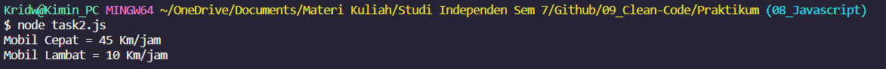

## Resume Materi Clean Code

Nama : Rizky Nurfauzi  
Kelas : React A

**_Clean Code_** adalah istilah untuk code yang mudah dibaca, dipahami, dan diubah oleh programmer.

### Kenapa kita harus menggunakan _Clean Code_?

1. **Work Colaboration**
   _Clean Code_ ini sangat berguna pada saat bekerja bersama team, karena akan memudahkan rekan untuk memahami apa yang kamu tuliskan.
2. **Feature Development**
   _Clean Code_ juga berguna untuk pengembangan fitur pada aplikasi yang kalian buat, dan akan memudahkan untuk memodifikasi code yang berlanjut pada.
3. **Faster Development**
   dimana _Clean Code_ akan mempercepat pekerjaan dikarenakan kita sudah memahami _flow_ dari code yang kita tulis dan membuat pekerjaan lebih efisien juga.

### Karakteristik Clean Code

1. Mudah dipahami.
2. Mudah dieja dan dicari.
3. Singkat namun mendeskripsikan konteks.
4. Konsisten khususnya dari penamaan case.
5. Hindari penambahan konteks yg tidak perlu.
6. Komentar, komentar yang baik hanya memberikan komentar pada 1 blok yang mempresentasikan suatu fungsi.
7. Good Function, dimana bila terdapat banyak parameter pada function, kita dapat memasukkannya kedalam object sebagai informasi dari setiap parameternya.
8. Gunakan konvensi, kita menggunakan style coding yang sudah banyak digunakan developer. referensi: [airbnb](https://github.com/airbnb/javascript).
9. Formatting, saran dari formatting :
   - Lebar baris code 80-120 karakter.
   - Satu class 300-500 baris.
   - Baris code yang berhubungan harus berdekatan.
   - Dekatkan fungsi dengan pemanggilnya.
   - Deklarasi variabel berdekatan dengan penggunannya.
   - Perhatikan indentasi.
   - Menggunakan _prettier_ atau _formatter_.

### Prinsip Clean Code

1. KISS (_Keep It So Simple_)  
   Hindari membuat fungsi yang dibuat untuk melakukan A, sekaligus memodifikasi B, mengecek fungsi C, dst.
   - Fungsi atau class harus kecil.
   - Fungsi digunakan untuk melakukan satu tugas saja.
   - Jangan gunakan terlalu banyak argumen pada fungsi.
   - Harus diperhatikan untuk mencapai kondisi yang seimbang, kecil dan jumlahnya minimal.
2. DRY (_Don't Repeat Yourself_)  
   Duplikasi code terjadi karena kita sering _copy-paste_. Untuk menghindari duplikasi code buatlah fungsi yang dapat digunakan secara berulang-ulang.
3. Refactoring  
   Refactoring adalah proses restrukturisasi code yang dibuat, dengan cara megubah struktur internaltanpa mengubah perilaku eksternal. Prinsip KISS dan DRY dapat dicapai dengancara refaktor.
   Teknik Refactoring :
   - Membuat Abstraksi
   - Memecah code dengan fungsi dan class.
   - Perbaiki penamaan dan lokasi code.
   - Deteksi code yang memiliki duplikasi.

### Screenshot Task 2 Clean Code

