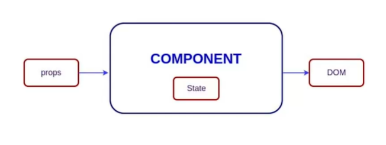
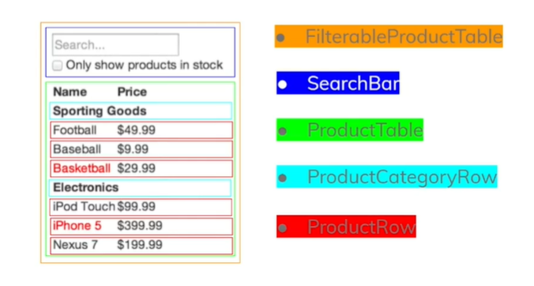
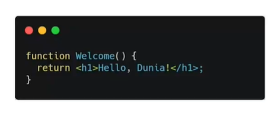
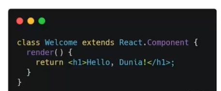
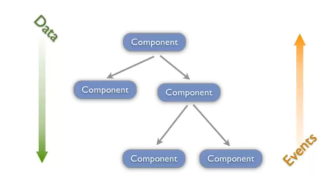
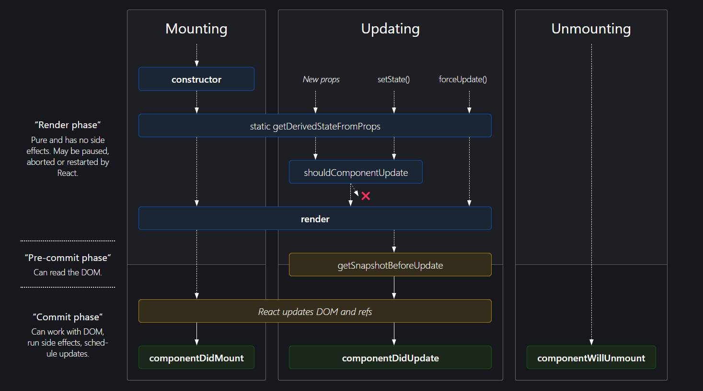

## Resume Materi React Fundamental

Nama : Rizky Nurfauzi  
Kelas : React A

### JSX

- Singkatan dari Javascript XML
- Ekstensi pada javascript

Contoh JSX

```js
const element = <h1>Hello, World!</h1>;
```

Kenapa menggunakan JSX ?

- JSX dibuatkan berdasarkan fakta kalau logika rendering sangat terikat dengan logic UI
- Separation of Technology -> Separation of Concerns

Spesifikasi Jenis Elemen React

- Kapitalisasi untuk komponen React
- Huruf kecil, lowercase untuk komponen bawaan

### React Component

> **Komponen React adalah bagian dari code yang digunakan untuk tampilan, behaviour, dan state sebagian UI**



- Membagi UI Menjadi Beberapa Komponen



### Function & Class Component

- Function Component



- Class Component



### Component Composition & Props

**Props**

1. Singkatan dari _properties_, yang dapat memberikan argumen/ data pada component
2. Props membantu untuk membuat komponen menjadi lebih dinamis
3. Props dioper ke component sama seperti memberikan atribut pada tag HTML
4. Props pada component adalah _read-only_ dan tidak dapat berubah

**One Way data flow React**



**Komposisi Component**

Ada 2 Tipe komposisi pada Component

1. Kontainmen
2. Spesialisasi

### React Lifecycle



Lifecycle method yang umum

1. `render`, Fungsi yang sering dipakai dan dibutuhkan pada class component.
   Contoh :
   ```js
   class Hello extends Component {
     render() {
       return <div>Hello {this.props.name}</div>;
     }
   }
   ```
2. `componentDidMount()`, method yang dipanggil pertama kali ketika komponen sudah di mount, dan tempat yg tepat untuk pemanggilan API
3. `componentDidUpdate()`, dipanggil bila terjadi update (props atau state berubah)
4. `componentWillUnmount()`, dipanggil ketika component akan dihancurkan, cocok untuk _clean up actions_.
   Contoh :
   ```js
   componentWillUnmount(){
    window.removeEventListener('resize', this.resizeListener)
   }
   ```

Lifecycle method lainnya:

1. `shouldComponentUpdate()`
2. `static getDrivedStateFromProps()`
3. `getSnapshotBeforeUpdate()`

### React Conditioning

Pada react, kita dapat membuat komponen berbeda yang mencakup perilaku yang dibutuhkan. Lalu kita dapat me-render hanya beberapa bagian saja, berdasarkan state dari aplikasi Kita.

**Render Bersyarat**

- Menggunakan `if`
- Inline `if` dengan operator `&&`
- Inline `if-else` dengan _ternary conditional operator_
- Mencegah komponen untuk rendering

**Render List**

- Kita dapat membangun koleksi dari beberapa elemen dan menyertakannya dalam JSX menggunakan tanda kurung kurawal {}
- Key membantu React untuk mengidentifikasi item mana yang telah diubah, ditambahkan, atau dihilangkan.
- Kita bisa me-render list dengan menggunakan fungsi map() untuk mengambil data yang ada.
