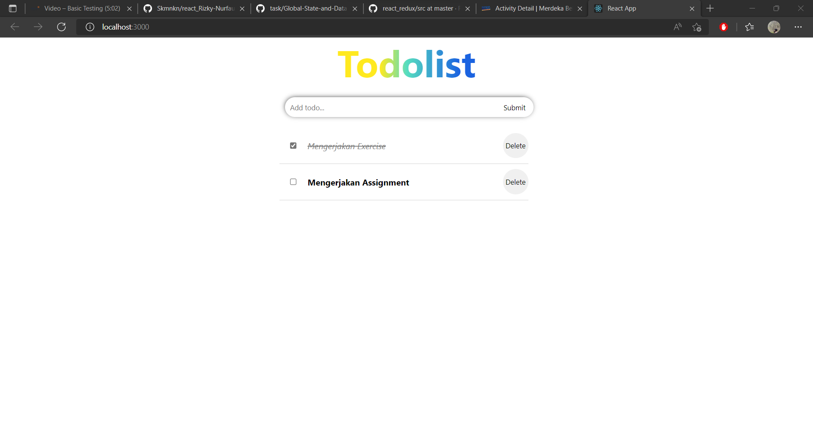

## Resume Materi React Hook

Nama : Rizky Nurfauzi  
Kelas : React A

### React Hook

React Hook adalah fitur baru pada React 16.8. Dengan Hooks, kita dapat menggunakan state dan fitur React yang lain tanpa perlu menulis sebuah kelas.

### Hooks pada React

| Hooks dasar | Hooks Tambahan      |
| ----------- | ------------------- |
| useState    | useReducer          |
| useEffect   | useCallback         |
| useContect  | useMemo             |
|             | useRef              |
|             | useImperativeHandle |
|             | useLayoutEffect     |
|             | useDebugValue       |

### Deklarasi variable state

- Class Component

```js
class Example extends React.Component {
  constructor(props) {
    super(props);
    this.state = {
      count: 0,
    };
  }
}
```

- Function Component with Hooks

```js
import { useState } from "react";

function Example() {
  // Deklarasi variable state baru yang disebut "count"
  const [count, setCount] = useState(0);
}
```

### Custom Hooks

Membuat Hook kita sendiri yang memungkinkan kita mengekstrak komponen logika ke fungsi yang dapat digunakan lagi.

### Screenshots Task React Hooks


