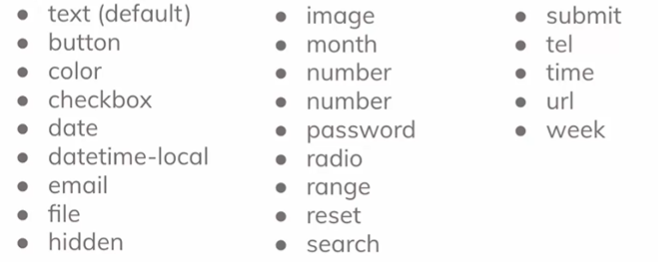
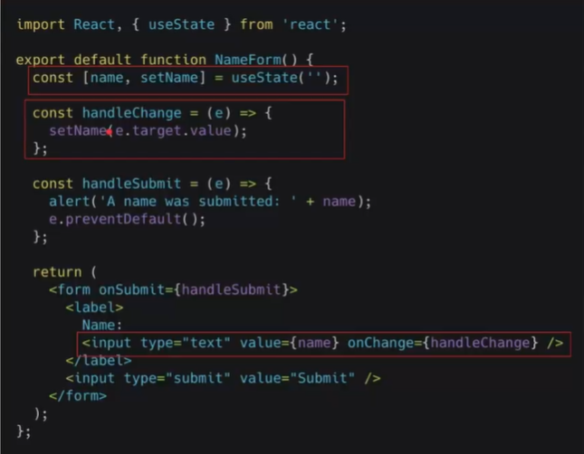
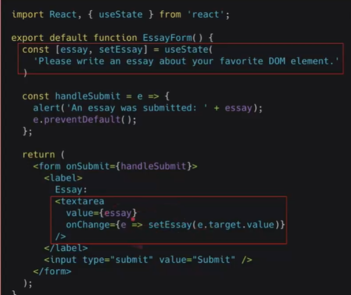
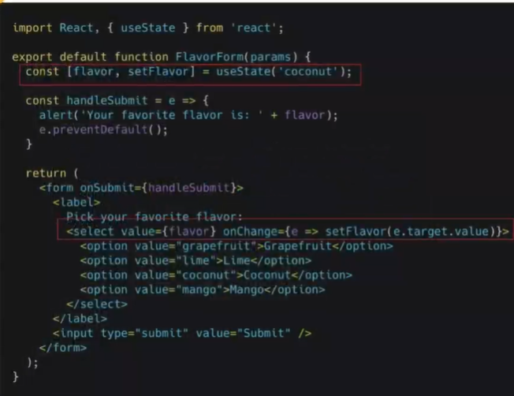
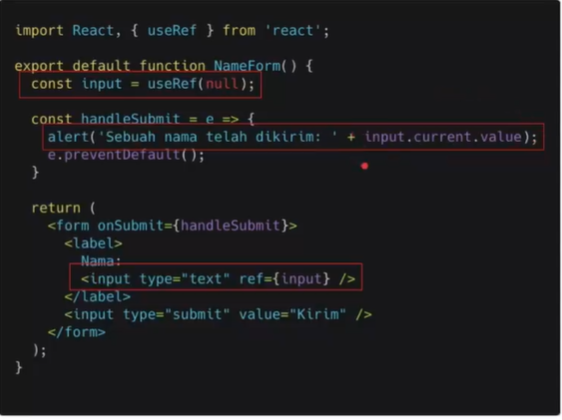

### Resume React Form

Nama : Rizky Nurfauzi  
Kelas : React A

### React Form

Form merupakan salah satu hal krusial dalam pengembangan aplikasi website. Form dapat digunakan untuk mengahandle inputan dari user.

Form banyak kita jumpai saat login, mendaftarkan sesuatu, memberikan feedback, mengisi data dan masih banyak lainnya.

Dalam react akan ada banyak hal yang dipelajari dari Form. Seperti bagaimana menghandle inputan?, Bagaimana validasi inputan dsb.

### Macam-macam Form

- Elemen `<input>`
  Biasanya digunakan untuk inputan yg tidak terlalu panjang. Contoh :
  ```js
  <label>
    <p>Nama</p>
    <input name="name" />
  </label>
  ```
- Elemen `<textarea>`
  Digunakan untuk inputan yg cukup panjang. Contoh

  ```js
  <label>
    <p>Deskripsi</p>
    <textarea name="deskripsi" />
  </label>
  ```

- Elemen `<select>`
  Digunakan untuk inputan yang pilihannya sudah ditentukan. Contoh :

  ```js
  <label>
    <p>Buah</p>
    <select>
      <option value="">Pilih Buah</option>
      <option value="apel">Apel</option>
      <option value="fuji">Fuji</option>
      <option value="mangga">Mangga</option>
    </select>
  </label>
  ```

- Radio Button
  Merupakan salah satu type di element `<input>`. Kita hanya bisa memilih 1 pilihan menggunakan radio button.

  ```js
  <label>
    <p>Jenis Kelamin</p>
    <input type="radio" name="male" value="male" />
    Laki-Laki
    <input type="radio" name="female" value="female" />
    Perempuan
  </label>
  ```

- Checkbox
  ```js
  <label>
    <p>Jadwal kegiatan</p>
    <input type="checkbox" name="pagi" value="pagi" />
    Pagi
    <input type="checkbox" name="malam" value="malam" />
    Malam
  </label>
  ```
- Type elemen lainnya
  

### Controlled Component

> Kita dapat menggabungkan cara menyimpan dan memperbarui state di HTML dan React dengan menggunakan state pada React. Kemudian komponen React yang me-render sebuah form juga mengontrol apa yang terjadi dalam form tersebut pada masukan pengguna selanjutnya.
> Sebuah elemen masukan form yang nilainya dikontrol oleh React melalui cara seperti ini disebut sebagai _"controlled component"_.

- Controlled Component `<input>`
  
- Controlled Component `<textarea>`
  
- Controlled Component `<select>`
  

  Kita bisa memasukkan array kedalam atribut value, yg memungkinkan kita memilih beberapa opsi dalam tag `<select>`

### Uncontrolled Component

> Uncontrolled component adalah alternatif lain dari controlled component, dimana data form akan ditangani oleh DOM-nya sendiri. Untuk menulis uncontrolled component, alih-alih menulis event handler untuk setiap pembaruan state, kita bisa menggunakan ref untuk mendapatkan nilai form dari DOM.
> Karena hal ini, terkadang lebih mudah untuk mengintegrasikan kode React dan non-React jika menggunakan uncontrolled component. Ini berarti lebih sedikit kode jika kita menginginkan solusi cepat walau tak rapi. Selain itu pada umumnya kita harus menggunakan controlled component.


