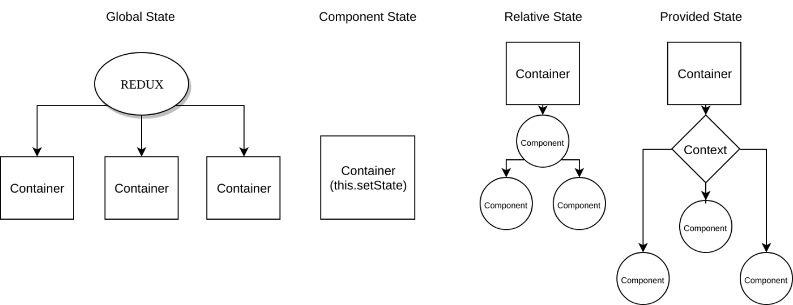
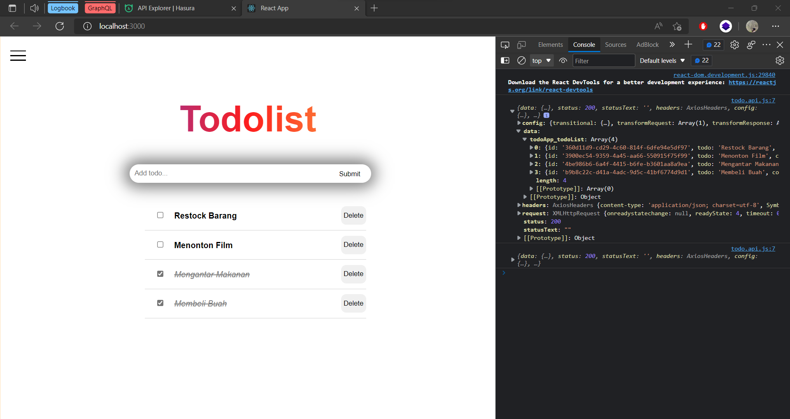
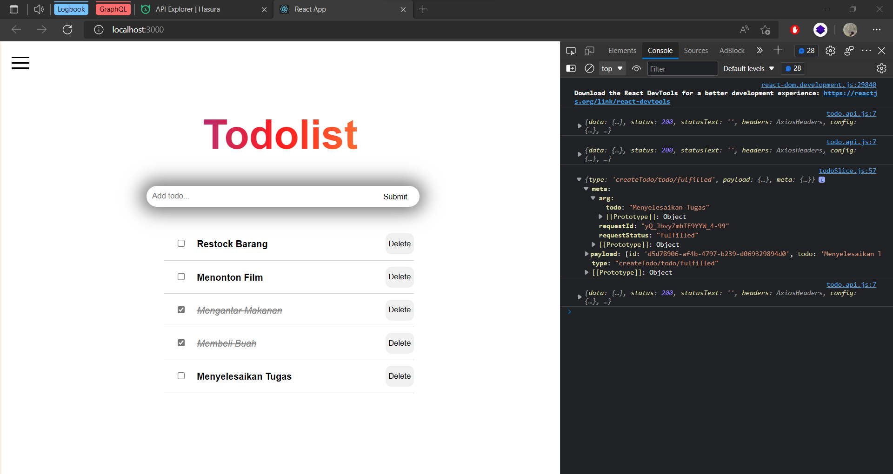
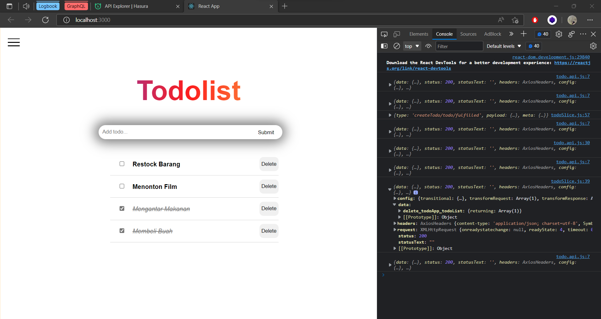

### Resume Global State Management

Nama : Rizky Nurfauzi  
Kelas : React A

## Global State

Terdapat 4 State management pada React, yaitu :

1. Local State
   Local state adalah data yang sering kita kelola dari satu ke lain komponen pada react, biasanya menggunakan `useState` hook
2. Global State
   Global state adalah data yang sering kita kelola dari banyak komponen, dan banyak toolkit pembantu Global State ini, contoh dari Global state adalah authentifikasi pada user state
3. Server State
   Server state adalah data yang berada di _external server_, contohnya React Query
4. URL State
   URL State adalah data yang ada di Url, contohnya pathname dan query parameter

### Kapan kita harus menggunakan Global State?

- Saat banyak state yang perlu ditaruh di banyak tempat
- State pada app sering berubah
- Logic untuk mengubah state kompleks
- Ukuran codebase yang sedang-besar, dan dikerjakan oleh banyak orang
- Perlu mengetahui bagaimana state diupdate seiring dengan waktu

### Beberapa library bantuan untuk penggunaan Global State

1. React Redux
2. Redux Toolkit
3. Redux DevTools Extension

### Redux Thunk

Thunk middleware memungkinkan kita untuk membuat action creator yang mengembalikan function bukan action. Redux thunk berguna untuk menghandle side effect logic seperti logic synchronous kompleks yang perlu mengakses store dan juga async seperti request data.

### Persisted State

Redux Persist merupakan library dari keluarga redux yang berguna untuk menyimpan state

## Data Fetching

Merupakan proses pengambilan data dari Server/API ke Aplikasi kita

- Cara Fetching data di React

1. Fetch API
2. Axios
3. React Query Library

- Object yang sering digunakan pada fetch()
  | Request | List |
  | ----------- | ---------------------------- |
  | method | GET, POST, PUT, DELETE, HEAD |
  | url | URL dari Request |
  | body | Body dari Request |
  | headers | Objek dari Headers |
  | referre | Referre dari request |
  | mode | cors, no-cors, same-origin |
  | credentials | amit, same-origin |
  | redirect | follow, error, manual |
  | integrity | subresource integrity value |
  | cache | cache mode(default, reload) |

## Task DATA Fetching

1. GET Axios Data
   
2. POST Axios Data
   
3. PUT Axios Data
   
4. DELETE Axios Data
   
