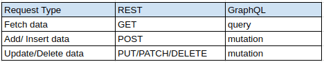
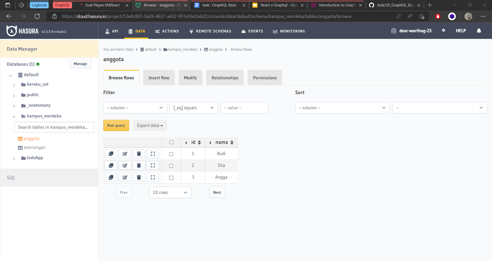
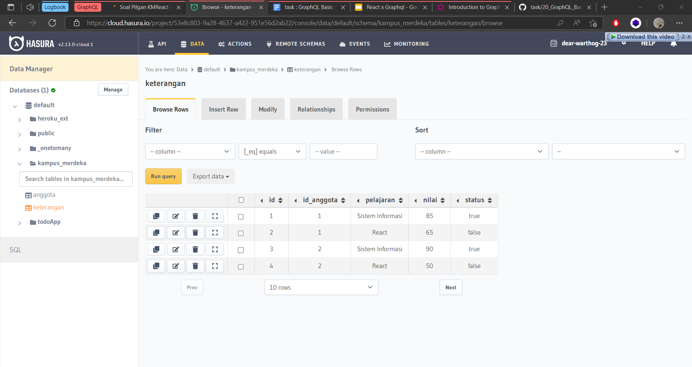

### Resume GraphQL Basic

Nama : Rizky Nurfauzi  
Kelas : React A

### What is API?

API atau Application Programming Interface adalah sebuah protokol atau teknologi yang digunakan untuk menangani bagaimana sebuah perangkat lunak dapat berinteraksi satu sama lain.

Salah satu contohnya adalah untuk mendapatkan data dari database.

Hingga saat ini, REST API merupakan salah satu teknologi API yang sering kita gunakan ketika akan mengembangkan sebuah Web APIs. REST API sendiri memiliki banyak kelebihan dan juga kemudahan dalam pengembangannya. Meskipun begitu, REST API masih belum dirasa cukup untuk menyelesaikan permasalahan yang ada sekarang dan juga mengikuti perkembangan teknologi yang semakin cepat.

## What is GraphQL?

GraphQL adalah bahasa yang digunakan untuk query API.

Sebagian bilang GraphQL bisa menjadi pengganti REST API, tetapi prakteknya GraphQL sering digunakan bersamaan dengan REST API dan bahkan saling melengkapi.

#### GraphQL vs REST API

Banyak dari kita lebih paham apa itu REST API daripada GraphQL, oleh karena itu di bagian ini kita akan bandingkan antara REST API dengan GraphQL.

Jika pada REST API ada kita gunakan banyak HTTP request method seperti GET, POST, PUT & DELETE. Pada GraphQL kita hanya menggunakan POST, dengan nama operasi Query & Mutation.

Berikut tabel perbandingan operasi pada REST dengan GraphQL.

Dengan pendekatan GraphQL kita dapat mengatur ketentuan apa saja atau data yang kita butuhkan pada sebuah query.

#### GraphQL Core Features

Ada 3 Core Features pada GraphQL, yaitu:

1. **Query**, get data berdasarkan query yang kita definisikan
2. **Mutation**, Insert, Update, Delete Data
3. **Subscription**, get update data secara _realtime_ atau _based on events_

## Task GraphQL Basic

### Add Anggota and Keterangan Table

### Call Query Status = True

### Insert Angga with Mutation

### Update False Query to True

