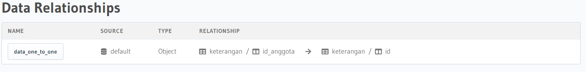
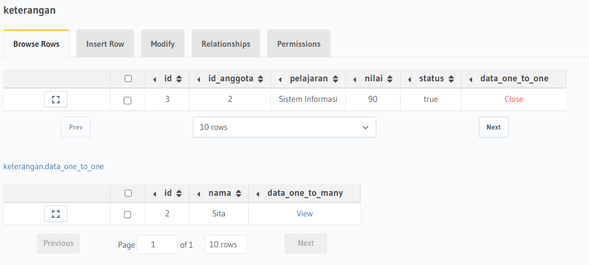
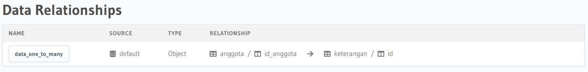
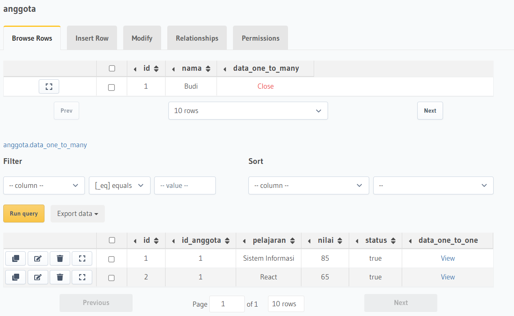

### Resume Relational Database

Nama : Rizky Nurfauzi  
Kelas : React A

## What is Relational Database?

_Relational Database_ adalah sebuah hubungan entity dalam database.

Terdapat 3 relational database, yaitu :

1. One to One : Contohnya satu user hanya memiliki 1 buah foto profil
2. One To Many : Contohnya satu user memiliki banyak tweet atau komentar
3. Many to Many : 1 user bisa memiliki banyak followers dan user tersebut dapat melakukan following banyak user

### Database Statements

1. DDL (Data Definition Languange)
   Jenis instruksi SQL yang berkaitan dengan pembuatan struktur tabel maupun database.
   ```sql
    CREATE DATABASE nama_database
    USE nama_database
    CREATE TABLE ...
    DROP TABLE ...
    RENAME TABLE ...
   ```
2. DML (Data Manipulation Languange)
   Jenis instruksi SQL yang berkaitan dengan data yang ada dalam tabel, tentang bagaimana menginput menghapus, memperbaharui serta membaca data yang tersimpan di dalam database.
   ```sql
   INSERT
   SELECT
   UPDATE
   DELETE
   ```
3. DCL (Data Control Languange)
   digunakan untuk merubah hak akses, memberikan roles, dan isu lain yang berhubungan dengan keamanan database.
   ```sql
   LIKE / BETWEEN
   AND / OR
   ORDER BY
   LIMIT
   ```

## Task Relational Database

### Nomor 1 : Membuat Relasi one to one

1. Membuat Relationship
   
2. Output Relationship
   

### Nomor 2 : Membuat Relasi one to many

1. Membuat Relationship
   
2. Output Relationship
   
