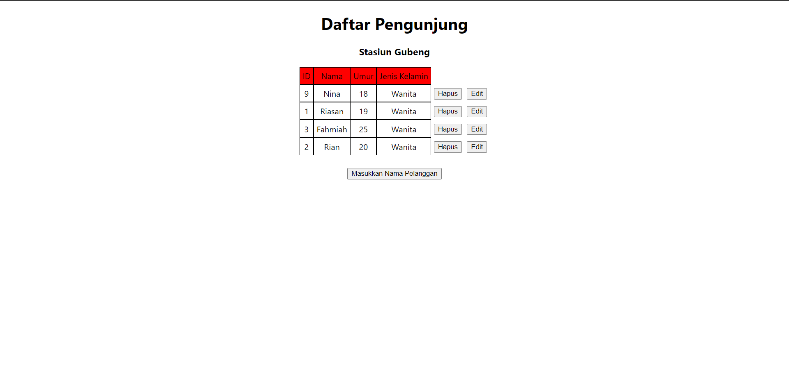
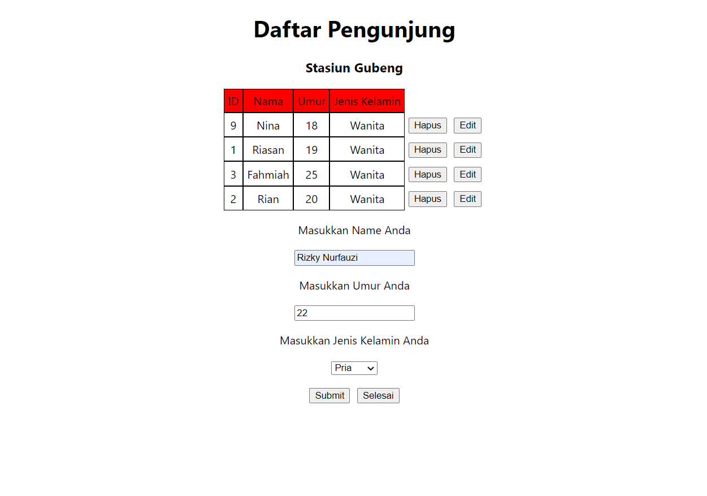
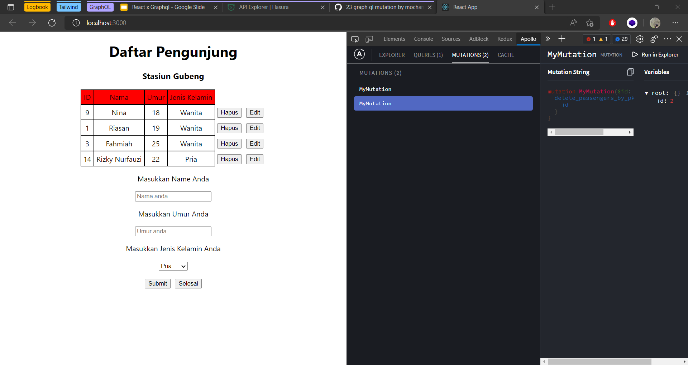
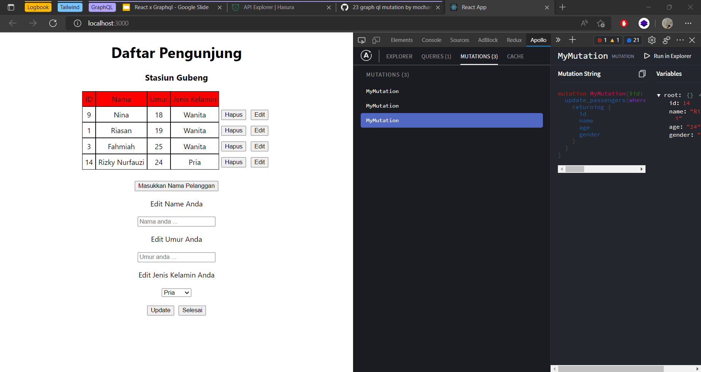

## Resume Materi GraphQL Mutation

Nama : Rizky Nurfauzi  
Kelas : React A

### Mutation

Mutation pada dasarnya adalah fungsi untuk memperbarui, menyisipkan dan menghapus data. Kita perlu mendefinisikan operasi apa yang ingin kita lakukan (berdasarkan operasi yang tersedia di server graphql kita) dan kemudian menentukan data apa yang GraphQL perlu kembalikan.

### Tahapan Mutation pada Project React

1.  Import useMutation hooks dari apollo client dan definisikan mutation yang akan dibuat.
2.  **Ketika akan melakukan Insert maka** :
    1. Definisikan mutation, contoh :
    ```
        export const InsertTodo = gql`
            mutation MutationInsert($newTodo: todos_insert_input!) {
                insert_todos_one(object: $newTodo) {
                id
                title
                completed
                user_id
                }
            }
        `;
    ```
    2. Buat useMutation dan lakukan destructuring array untuk penangan mutation (insertTodo) contoh : `const [insertTodo, { loading }] = useMutation(InsertTodo, { refetchQueries: [GetTodo] }); `
    3. Kemudian Panggil insertTodo dengan variabel, contoh :
       ```
       insertTodo({
           variables: {
               newTodo: {
                   id: Math.floor(Math.random() * 100),
                   title: title,
                   completed: false,
                   user_id: 1,
               },
           },
       });
       ```
3.  **Ketika akan melakukan Update maka**:

    1. Definisikan mutation, contoh :
       ```
           export const UpdateTodo = gql`
           mutation MutationUpdate($id: Int!, $completed: Boolean) {
           update_todos_by_pk(pk_columns: { id: $id }, _set: { completed: $completed }) {
           id
           title
           completed
           user_id
           }
           }
           ` ;
       ```
    2. Buat useMutation dan lakukan destructuring array untuk penangan mutation (updateTodo) contoh : `const [updateTodo, { loading: loadingUpdate }] = useMutation(UpdateTodo, { refetchQueries: [GetTodo] }); `
    3. Kemudian Panggil updateTodo dengan variabel, contoh :
       `updateTodo({ variables: { id: idx, completed: !item.completed } });`

4.  **Ketika akan melakukan Delete maka** :
    1. Definisikan mutation, contoh :
       ```
           export const DeleteTodo = gql`
            mutation MutationDelete($id: Int!) {
                delete_todos_by_pk(id: $id) {
                id
                }
            }
            `;
       ```
    2. Buat useMutation dan lakukan destructuring array untuk penangan mutation (deleteTodo) contoh : `const [deleteTodo, { loading: loadingDelete }] = useMutation(DeleteTodo, { refetchQueries: [GetTodo] }); `
    3. Kemudian Panggil updateTodo dengan variabel, contoh :
       `deleteTodo({ variables: { id: idx } });`

## Task

Pada tugas kali ini diperintahkan untuk melakukan mutation pada aplikasi todo yang telah disediakan, dimana nantinya harus dapat menambahkan data, update data, dan delete data.





